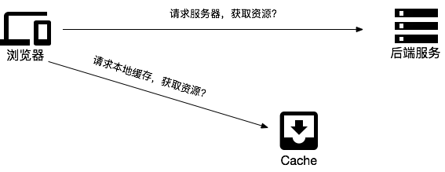

# PWA快速上手

> https://www.jianshu.com/p/916a01670a23

## summary

1. 开始
2. Manifest
3. WebApp离线
4. TroubleShooting
5. push
6. 调试
7. Notification
8. Service Worker
9. 实践中的问题

## 1. 开始

> 将web app做出nativeApp体验的一种技术. 

涉及到的技术:
- Web App Manifest
- Service Worker
- Cache API 缓存
- Push&Notification 推送与通知
- Background Sync 后台同步
- 响应式设计

```sh
git clone git@github.com:alienzhou/learning-pwa.git
# 切换到基础项目分支
git checkout basic
```

## 2. Manifest

## 3. WebApp离线

> 通过Service Worker实现

Service Worker可以理解为一个独立于前端页面,在客户后台独立运行的进程. 它不会阻塞浏览器脚本的运行, 也无法直接访问浏览器相关API. 处理缓存\推送\通知与同步等工作.

> SW只能运行在http是和localhost下.



普通请求和SW请求的区别


## 4. TroubleShooting

## 5. push

## 6. 调试

## 7. Notification

## 8. Service Worker

## 9. 实践中的问题