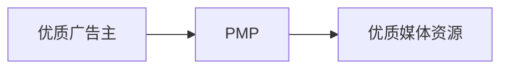

# 业务梳理

## 业务流

## 关键字解释

**RTB**: real time bidding, 实时竞价

**DSP**: Demand Side Platform, 需求方平台

> - 从广告主买来offer, 按一定的竞价规则, 及卖给DSP, 当合适的机会出现, DSP平台对offer进行展示, 收取费用.
> - 服务于甲方(广告主)或代理公司, 是集媒体资源购买, 投放策略制定, 投放实施优化, 出具分析报告等功能为一体的一站式广告需求方平台.

**品类**: 是指在顾客眼中, 一组相关联的或可相互替代的商品或服务.

**广告交易平台AD Exchange**:

**SSP**: 供应方平台

**Agency Trading Desk**: ATD / TD, 代理交易平台, 更优质的DSP, 依托4A广告公司, 能够提供全面高端的服务,包括但不限于(DSP, DMP, SEM, BrandSafety, 传统方式这些全案能力)
    * DMP: Data Management Platform, 数据管理平台.
    * BrandSafety: 让客户广告不出现在垃圾媒体和负面媒体的能力.

**PMP**: Private Markerplace, 私有交易市场. 

> 三种方式:
> 1. 广告位预留,价格固定
> 2. 使用空闲广告位,价格固定
> 3. 对空闲广告位竞争,价格不固定

因为下述原因, PMP未来会成为各个DSP标配功能, 要么作为公司旗下独立产品, 要么作为内置或隐藏功能.
1. 甲方爸爸对于品牌安全要求的合理性
2. 部分甲方传统观念短时间内难以扭转
3. DSP平台之间激烈竞争

**AD Network**: 广告网络, 由众多中小媒体组合组成.
与主流门户媒体的区别:
1. 媒体众多, 但是质量普遍不高, 大多数都是除了提供广告位没有其他变现渠道的中小网站.
2. 以CPM\CPC的形式售卖, 单价低, 但实际推广转化成本偏高
3. 定位人群的误差较大

部分广告网络转向了DSP, 部分广告网络因为价格低廉和垂直于某个行业, 一定历史时期内还会继续存在. 

##　问题整理

1. AD Exchange和SSP的区别?
