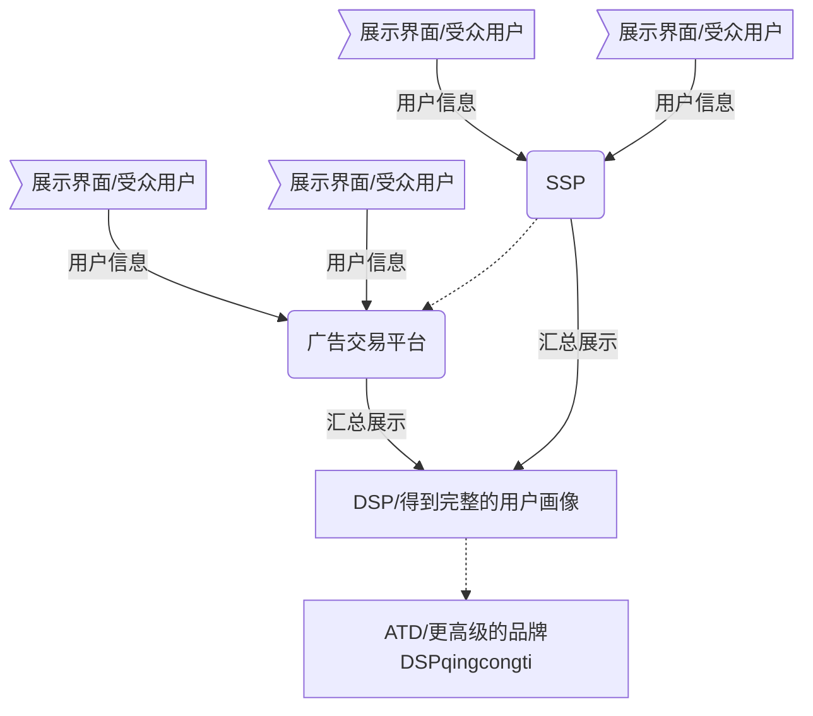
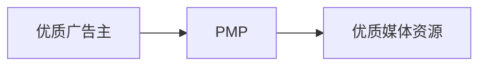
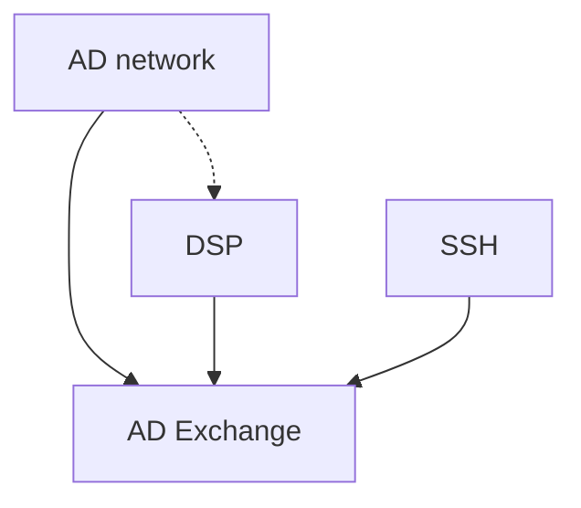
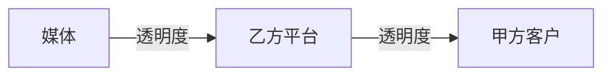

# 业务梳理

## 业务流

## 关键字解释

**RTB**: real time bidding, 实时竞价

**DSP**: Demand Side Platform, 需求方平台

> - 从广告主买来offer, 按一定的竞价规则, 及卖给DSP, 当合适的机会出现, DSP平台对offer进行展示, 收取费用.
> - 服务于甲方(广告主)或代理公司, 是集媒体资源购买, 投放策略制定, 投放实施优化, 出具分析报告等功能为一体的一站式广告需求方平台.

**品类**: 是指在顾客眼中, 一组相关联的或可相互替代的商品或服务.

**广告交易平台AD Exchange**:

**SSP**: 供应方平台

**Agency Trading Desk**: ATD / TD, 代理交易平台, 更优质的DSP, 依托4A广告公司, 能够提供全面高端的服务,包括但不限于(DSP, DMP, SEM, BrandSafety, 传统方式这些全案能力)
    * DMP: Data Management Platform, 数据管理平台.
    * BrandSafety: 让客户广告不出现在垃圾媒体和负面媒体的能力.

**PMP**: Private Markerplace, 私有交易市场. 

> 三种方式:
> 1. 广告位预留,价格固定
> 2. 使用空闲广告位,价格固定
> 3. 对空闲广告位竞争,价格不固定

因为下述原因, PMP未来会成为各个DSP标配功能, 要么作为公司旗下独立产品, 要么作为内置或隐藏功能.
1. 甲方爸爸对于品牌安全要求的合理性
2. 部分甲方传统观念短时间内难以扭转
3. DSP平台之间激烈竞争

**AD Network**: 广告网络, 由众多中小媒体组合组成.
与主流门户媒体的区别:
1. 媒体众多, 但是质量普遍不高, 大多数都是除了提供广告位没有其他变现渠道的中小网站.
2. 以CPM\CPC的形式售卖, 单价低, 但实际推广转化成本偏高
3. 定位人群的误差较大

部分广告网络转向了DSP, 部分广告网络因为价格低廉和垂直于某个行业, 一定历史时期内还会继续存在. 

**AD Exchange**: 广告交易平台

**DMP**:Data Management Platform 数据管理平台, 收集数据,并对数据进行挖掘分析.
> 功能主要为手机数据并对数据进行挖掘分析，用火的的分析结果指导决策。还可以使用这些梳理过的数据自定义广告受众，提高广告投放的效果。

> 数据收集阶段: 把尽可能多的渠道收集来的数据，进行同源化处理（mapping），得到一个个用户的画像。
> 数据挖掘阶段: 依据人群维度, 媒体维度, 内容维度等不同维度, 通过建模分析数据并获取报告.
> 数据运用: 精准投放

分类:
1. 按照使用者分类: 面向甲方的DMP(指导广告投放策略) 面向乙方 面向媒体
2. 按照数据所有者区分: 定制化专属DMP, 第三方DMP.
3. 按照形式区分: 以DMP自用, 第三方检测工具

**Advertising Agency**:广告代理商,广告公司. 制作广告和文案创意鞥努力,也提供促销工具. 主要收入为服务费和合作广告平台的返点.

**ATD**: Agency Trading Desk, 程序化广告购买交易桌面.

##　常见概念

1. Algorithm算法:
> 核心两点: 受众选择 和 实时竞价
> 从AD Exchange\ Ad Network\ SSP 得到海量受众数据, 进行筛选和细分, 输出为各种目标投放用户集., 并通过人工经验或估算,给每组设置一个基础出价.
> 当这些受众在可触及媒体出现后, 迅速给出报价(100ms内)

2. Blacklist: 黑名单: 表现不好的媒体 

3. CVR转化率: 转化的次数/点击的次数=转化率. 
> 转化次数和点击数来自于同一个渠道才有效
> 各个行业转化率没有可比性
> 转化率核心是产品,营销手段是辅助
> 同一目标群体转化率逐步趋于下滑

4. Day-parting 分时段投放
> 利:
> 1. 避开非营业时间,避免预算浪费.
> 2. 可以针对时段调整出价

> 弊:
> 1. 对流量有影响: 切换有损耗.

5. 美式英语
考虑到同一区域人群中语言多样性

6. Frequency Cap 频次上线.

Mapping 映射: 平台cookie到DSPcookie的映射.

Native Ads原生广告: 植入广告.

Placement 展示位置: 
> 广告内容需要与媒体内容体现出一致性.

> 移动横幅 插屏 开屏 横幅 页首横幅 方形 小方形 大矩形 内插举行 摩天大楼 宽幅摩天大楼 

QPS: Query Per Second 每秒请求数: 下游流量平台发送的展示机会请求.

Retargeting:重定向:可以理解为对来访过或者分析出的意向客户,精准投放的方式. 

Transparency透明度:

> 客户对透明度的渴求,是无止境的.

USP独家卖点:
> 各DSP安身立命之本,和别家竞争的资本:
> 1. 资源:好的媒体资源
> 2. 技术:
> 3. 服务:可靠\相应\保证\移情\有形, 返点.

Visibility可见性:
> 1. 甲方看不见: 受众小
> 2. 受众看不到: 假数据,欺骗.

White Label白标: 广告公司使用技术公司的模板DSP, 把自己包装成DSP, 赚广告主钱.
> 技术公司收费: 1. 按照技术服务收费; 2. 广告主费用提成.

## 三方数据

> 跳过

## 程序化交易广告玩法

## 实际的DSP

## 保证投放效果的策略