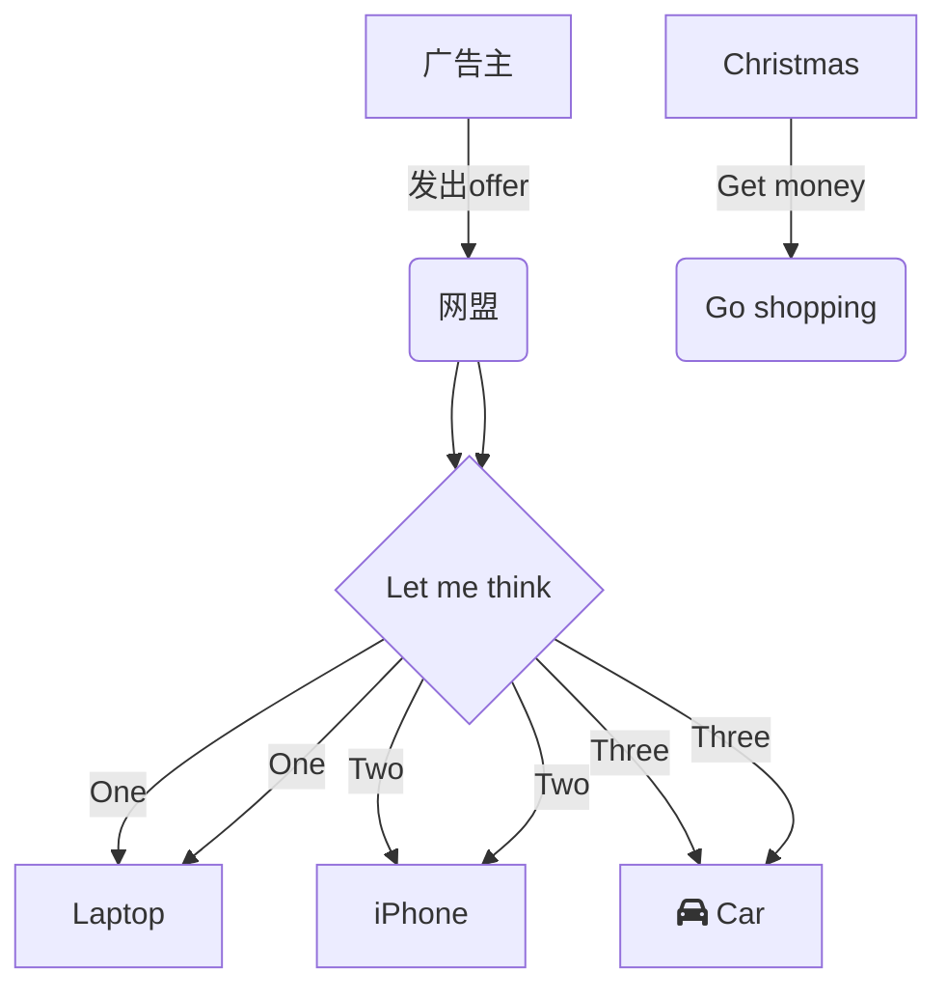

# 业务梳理

## 关键字解释

**RTB**: real time bidding, 实时竞价

**DSP**: Demand Side Platform, 需求方平台
> 从广告主买来offer, 按一定的竞价规则, 及卖给DSP, 当合适的机会出现, DSP平台对offer进行展示, 收取费用.

## 业务流

### 流量方向

```mermaid
graph TD
A[广告主] -->|发出offer| B(网盟)
B --> C{Let me think}
C -->|One| D[Laptop]
C -->|Two| E[iPhone]
C -->|Three| F[fa:fa-car Car]

AA[Christmas] -->|Get money| BB(Go shopping)
B --> C{Let me think}
C -->|One| D[Laptop]
C -->|Two| E[iPhone]
C -->|Three| F[fa:fa-car Car]
```
