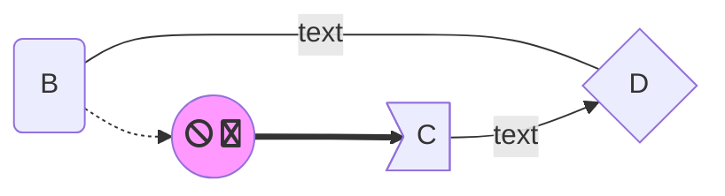
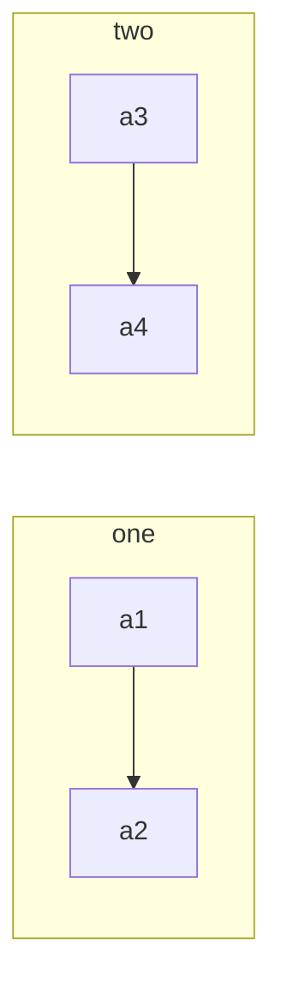
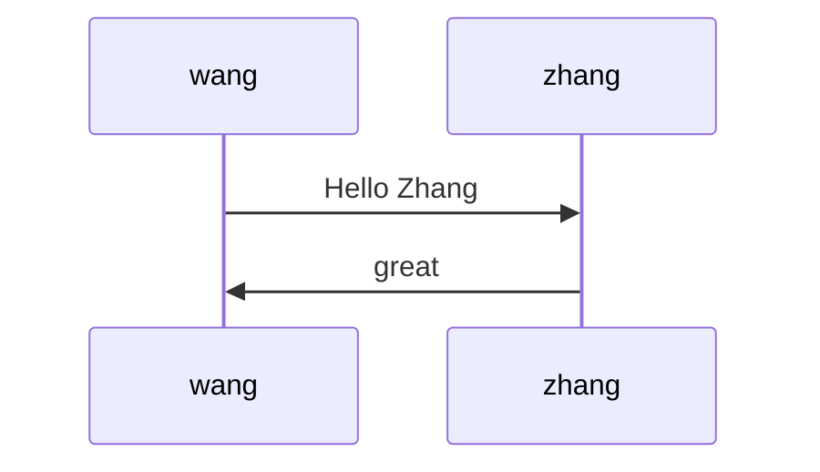

# Mermaid
## flowchart


## 用法
代码标识符开始加`mermaid`

### 方向
`graph`表示流程图，有四个方向
标识符|方向
---|---
TB|从top到bottom
BT|从bottom到top
LR|从Left到right
RL|从right到left

### 节点
符号|含义|备注
---|---|---
[]|矩形|默认
()|圆角矩形|
(())|圆形|
>]|旗型|
{}|菱形|

### 线型
符号|含义|备注
---|---|---
-->|直线箭头|
---|直线|
-.-|电线|
-.->|点线箭头
==>|粗线箭头|
===|粗线|

### 线上文本
--text-->
--text---
-.text.-
-.text.->
==text==>
==text===
-->|text|
---|text|

### 子模块
```
subgraph 模块名
    流程定义
end
```



## sequence diagrams时序图
