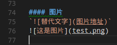
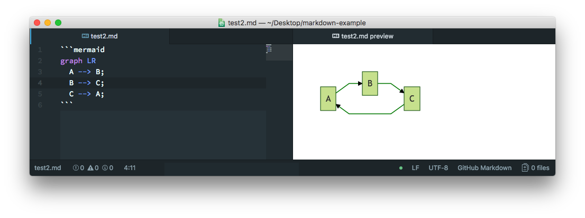
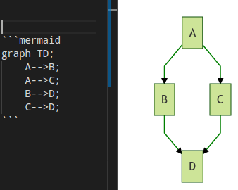
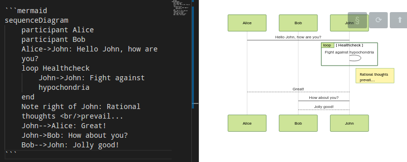
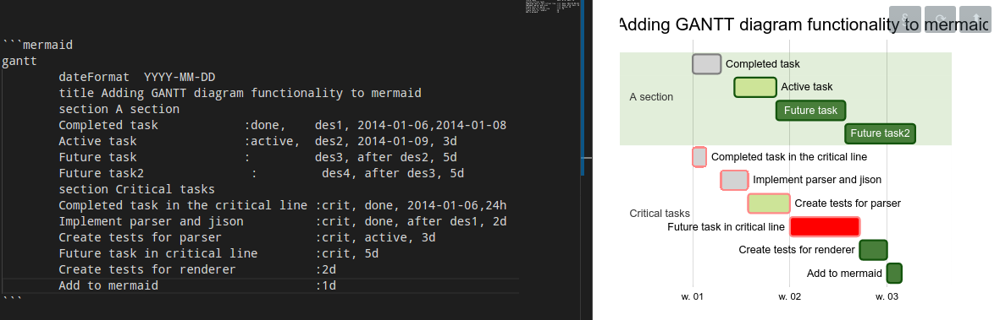

# Markdown Preview Enhanced
> 一个很好的vscode插件，让markdown成为写作神器

## 安装

在vscode编辑器中，***ctrl+shift+x***打开插件页，搜索***markdown-preview-enhanced***，点击安装。

## markdown基本用法
`Markdown`是一种通过符号表示格式的方法。

### 语法说明
#### 标题

```
# h1标题
## h2标题
### h3标题
#### h4标题
##### h5标题
###### h6标题
```
> 通过`{#.id .class1 .class2}`可以添加id或class，便于css。这是MPE的扩展特性

```
# 这是有id的标题 {#my_id}
# 这是有两个class的标题 {.class1 .class2}
```

#### 强调
```
*这是斜体*
_这也是斜体_
**这是加粗**
__这也是加粗__
_这是**斜体和加粗**的组合效果_
~~这是有删除线~~
```

下面是显示效果

*这是斜体*
_这也是斜体_
**这是加粗**
__这也是加粗__
_这是**斜体和加粗**的组合效果_
~~这是有删除线~~

#### 列表
##### 无序列表
```
* 无序列表
    * 二级列表
    * 二级列表
* 无序列表
```
* 无序列表
    * 二级列表
    * 二级列表
* 无序列表
##### 有序列表
```
1. 一级
    1.1 二级
    1.2 二级
2. 第二行
    2.1 二行一列
```
1. 一级
    1.1 二级
    1.2 二级
2. 第二行
    2.1 二行一列

#### 图片
``


#### 链接
`[显示文字][地址]`
[百度](http://www.baidu.com)

#### 引用

`> 这就是引用`

> 这就是引用

#### 分割线
```
--- 三个连字符
*** 三个星号
___ 三个下划线
```
---
***
___

#### 代码块

    `单行代码`
    ```
    多行代码
    ```
    或者tab缩进也是代码块

##### 语法高亮
在代码块开始符号后跟语言名称，例如 **```c**表示c语言语法高亮。
```c
//有语法高亮的代码块
#include <stdio.h>
int main()
{
    printf("hello world!\n");
    return 0;
}
```

```
//没有语法高亮的代码块
#include <stdio.h>
int main()
{
    printf("hello world!\n");
    return 0;
}
```
##### 添加{.line-numbers}类可以显示代码行数
    ```javascript {.line-numbers}
    var str="hello world!";
    console.log("Hello world!");
    ```

```javascript {.line-numbers}
var str="hello world!";
console.log(str);
```

#### 任务列表
```
- [x] @mentions, #refs, [links](), **formatting**, and <del>tags</del> supported
- [x] list syntax required (any unordered or ordered list supported)
- [x] this is a complete item
- [ ] this is an incomplete item
```

- [x] @mentions, #refs, [links](), **formatting**, and <del>tags</del> supported
- [x] list syntax required (any unordered or ordered list supported)
- [x] this is a complete item
- [ ] this is an incomplete item

#### 表格
```
First Header | Second Header
------------ | -------------
Content from cell 1 | Content from cell 2
Content in the first column | Content in the second column
```
First Header | Second Header
------------ | -------------
Content from cell 1 | Content from cell 2
Content in the first column | Content in the second column


##### 表格合并
> 扩展语法，需要设置

|a|b|
|---|---|
|1|2|
|^|4|

#### emoji
:smile:`:smile:`
:email:`:email:`
:telephone:`:telephone:`
:fa-car:`fa-car`
:print:

#### 上标
30^2^   `30^2^`
#### 下标
30~2~   `30~2~`

#### 脚注
```
Content [^1]

[^1]: Hi! This is a footnote
```
Content [^1]

[^1]: Hi! This is a footnote

#### 缩略
*[HTML]: Hyper Text Markup Language
*[W3C]:  World Wide Web Consortium
The HTML specification
is maintained by the W3C.
```
*[HTML]: Hyper Text Markup Language
*[W3C]:  World Wide Web Consortium
The HTML specification
is maintained by the W3C.
```

#### 标记
==marked== `==marked==`

#### 数学
默认下的分隔符：
```
    $...$ 或者 \(...\) 中的数学表达式将会在行内显示。
    $$...$$ 或者 \[...\] 或者 ```math 中的数学表达式将会在块内显示。
```
例如:`$f(x)=sin(x)+12$`
$f(x)=sin(x)+12$
$$ \sum_{n=1}^{100}n $$

## 图像
### 流程图
Markdown Preview Enhanced使用mermaid来渲染流程图和时序图

#### mermaid用法如下


#### mermaid支持三种主题，可通过`ctrl+shift+p` -> `Markdown Preview Enhanced: Open Mermaid Config` 命令打开 mermaid 配置文件
* mermaid.css
* mermaid.dark.css
* mermaid.forest.css

#### mermaid语法
##### 流程图示例

```
graph TD;
    A-->B;
    A-->C;
    B-->D;
    C-->D;
```

##### 时序图示例


##### 甘特图


<!-- /code_chunk_output -->

<!-- /code_chunk_output -->
