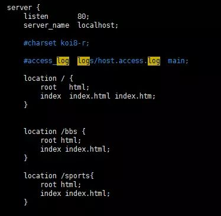

# 关于nginx的配置文件

```
# 查找nginx应用程序路径
ps -aux | grep nginx

# 查找nginx配置文件
./nginx -t

# 启动nginx
./nginx -c 配置文件
# -c 参数若省略,使用默认配置文件

# 其他命令
./nginx -s reload   # 重新读取配置文件
./nginx -s quit     # 退出nginx
```

## master&worker

### master作用

读取并验证配置文件nginx.conf, 管理worker进程

### worker进程作用

每个worker进程维护一个线程, 处理链接和请求. 
worker数量在nginx.conf配置

### nginx的热部署

master读取新nginx.conf, 创建新的worker进程接受新请求. 老的worker执行完当前请求后关闭.


###  通过keepalived实现高可用

Keepalived+Nginx实现高可用的思路：

1. 请求不要直接打到Nginx上，应该先通过Keepalived（这就是所谓虚拟IP，VIP）

2. Keepalived应该能监控Nginx的生命状态（提供一个用户自定义的脚本，定期检查Nginx进程状态，进行权重变化,，从而实现Nginx故障切换）


## nginx.conf

1. 虚拟主机



 1.1. location可以进行正则匹配，应该注意正则的几种形式以及优先级。（这里不展开）
 1.2. Nginx能够提高速度的其中一个特性就是：动静分离，就是把静态资源放到Nginx上，由Nginx管理，动态请求转发给后端。

2. 反向代理[proxy_pass]

3. 负载均衡[upstream]

