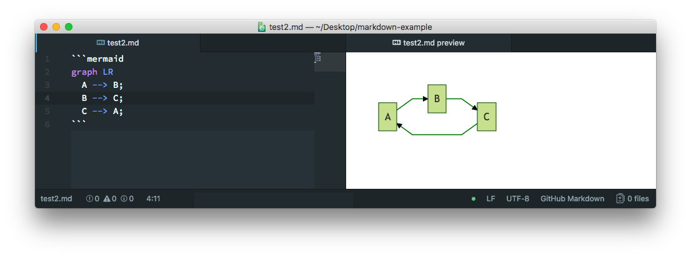
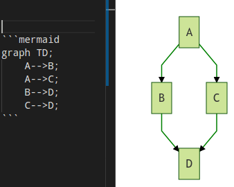
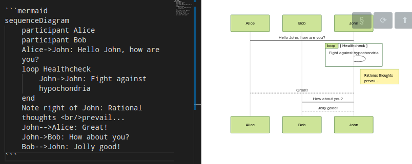

***
___
  
#### 代码块
  
  
    `单行代码`
    ```
    多行代码
    ```
    或者tab缩进也是代码块
  
##### 语法高亮
  
在代码块开始符号后跟语言名称，例如 **```c**表示c语言语法高亮。
```c
//有语法高亮的代码块
#include <stdio.h>
int main()
{
    printf("hello world!\n");
    return 0;
}
```
  
```
//没有语法高亮的代码块
#include <stdio.h>
int main()
{
    printf("hello world!\n");
    return 0;
}
```
##### 添加{.line-numbers}类可以显示代码行数
  
    ```javascript
    var str="hello world!";
    console.log("Hello world!");
    ```
  
```javascript
var str="hello world!";
console.log(str);
```
  
#### 任务列表
  
```
- [x] @mentions, #refs, [links](), **formatting**, and <del>tags</del> supported
- [x] list syntax required (any unordered or ordered list supported)
- [x] this is a complete item
- [ ] this is an incomplete item
```
  
- [x] @mentions, #refs, [links]( ), **formatting**, and <del>tags</del> supported
- [x] list syntax required (any unordered or ordered list supported)
- [x] this is a complete item
- [ ] this is an incomplete item
  
#### 表格
  
```
First Header | Second Header
------------ | -------------
Content from cell 1 | Content from cell 2
Content in the first column | Content in the second column
```
First Header | Second Header
------------ | -------------
Content from cell 1 | Content from cell 2
Content in the first column | Content in the second column
  
  
##### 表格合并
  
> 扩展语法，需要设置
  
|a|b|
|---|---|
|1|2|
|^|4|
  
#### emoji
  
:smile:`:smile:`
:email:`:email:`
:telephone:`:telephone:`
:fa-car:`fa-car`
:print:
  
#### 上标
  
30^2^   `30^2^`
#### 下标
  
30~2~   `30~2~`
  
#### 脚注
  
```
Content [^1]
  
[^1]: Hi! This is a footnote
```
Content [^1]
  
[^1]: Hi! This is a footnote
  
#### 缩略
  
*[HTML]: Hyper Text Markup Language
*[W3C]:  World Wide Web Consortium
The HTML specification
is maintained by the W3C.
```
*[HTML]: Hyper Text Markup Language
*[W3C]:  World Wide Web Consortium
The HTML specification
is maintained by the W3C.
```
  
#### 标记
  
==marked== `==marked==`
  
#### 数学
  
默认下的分隔符：
```
    $...$ 或者 \(...\) 中的数学表达式将会在行内显示。
    $$...$$ 或者 \[...\] 或者 ```math 中的数学表达式将会在块内显示。
```
例如:``

<p align="center"></p>  
  
  
## 图像
  
### 流程图
  
Markdown Preview Enhanced使用mermaid来渲染流程图和时序图
  
#### mermaid用法如下
  

  
#### mermaid支持三种主题，可通过`ctrl+shift+p` -> `Markdown Preview Enhanced: Open Mermaid Config` 命令打开 mermaid 配置文件
  
* mermaid.css
* mermaid.dark.css
* mermaid.forest.css
  
#### mermaid语法
  
##### 流程图示例
  
  
```
graph TD;
    A-->B;
    A-->C;
    B-->D;
    C-->D;
```

##### 时序图示例
  
  

##### 甘特图
  

  
<pre>Error: connect ETIMEDOUT 151.101.24.69:443</pre>  
  
```javascript
```

```
```

  
  
  
  
  
  