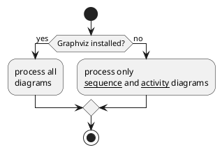

# damo王

## 附件：使用puml绘制流程图

```puml
@startuml

start

if (Graphviz installed?) then (yes)
  :process all\ndiagrams;
else (no)
  :process only
  __sequence__ and __activity__ diagrams;
endif

stop

@enduml
```